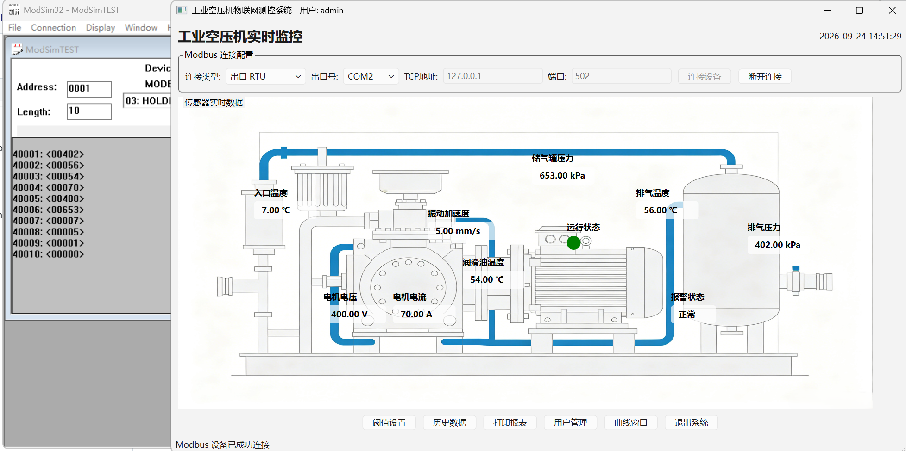

# Industrial Air‑Compressor IoT Monitoring System

> 
> 📌 Chinese version: [README.md](./README.md)

## 📖 Introduction

**Industrial Air‑Compressor IoT Monitoring System** is developed based on Qt6. It provides complete functions including air‑compressor device data acquisition, real‑time monitoring, over‑limit alarm, historical data storage, trend curve visualization and user permission management.


- Communication Protocol: **Modbus‑RTU (Serial Port) / Modbus‑TCP**
- Database: Local SQLite database
- Plotting Component: QCustomPlot
- Permission Model: Administrator / Ordinary User dual‑role system

## ✨ Features

1. **Device Communication & Data Acquisition**
   - Supports Serial RTU and Modbus‑TCP modes
   - Reads 10‑channel sensor holding registers of air‑compressor with a 1‑second cycle
2. **Real‑time Monitoring Interface**
   - Displays real‑time values of 10 sensors on flow‑chart background
   - Running status indicator and global alarm status hint
3. **Alarm Management**
   - Customizable upper and lower alarm thresholds for each sensor
   - Pop‑up warning window plus system beep when parameter exceeds limit. Alarm records are automatically persisted into database.
4. **Trend Curve**
   - Draw real‑time trend curves via QCustomPlot
   - Toggle visibility of specified sensor curves via checkboxes; view acquisition timestamp and values with mouse hover tooltip
5. **Historical Data Management**
   - Query historical sensor operating data within custom time range
   - Export historical data to CSV file for further analysis in Excel
6. **User & Permission Management**
   - User login authentication with two roles: **Administrator(0)** and **Ordinary User(1)**
   - Ordinary user: view‑only permission; Administrator: modify alarm thresholds, add / delete / edit system users
7. **Report Printing**
   - Supports printing of operation reports

## 🧱 Tech Stack

- GUI Framework: Qt 6 (Widgets, Qt Modbus, Qt SQL, Qt SerialPort, Qt PrintSupport)
- Database: SQLite3
- Plotting Library: QCustomPlot
- Communication: Qt Modbus (RTU / TCP)

## 📁 Project Structure

```
CompressorMonitor/
├── main.cpp                     # Program entry
├── mainwindow.h/cpp             # Main monitoring window
├── loginwidget.h/cpp            # Login dialog
├── modbusmanager.h/cpp          # Modbus communication manager
├── alarmmanager.h/cpp           # Alarm logic handler
├── databasehelper.h/cpp         # SQLite database wrapper
├── thresholddialog.h/cpp        # Alarm threshold setting dialog
├── curvedialog.h/cpp            # Real‑time trend curve window
├── historydialog.h/cpp          # Historical data query & export
├── usermanagerdialog.h/cpp      # User management dialog
├── qcustomplot.h/cpp            # QCustomPlot plotting component
├── res/                         # Resource files: background images
│   ├── login_bg.png
│   └── main_bg.png
├── res.qrc                      # Qt resource description file
├── CompressorMonitor.pro        # Qt project file
├── README.md                    # Chinese documentation
└── README_EN.md                 # English documentation
```

## ⚙️ Build & Run

### Directly use pre‑built Release binaries

### Environment Requirements

- Qt 6.11+ (Required components: `qtmodbus`, `qtserialport`, `qtsql‑sqlite`)
- Platform: Windows / Linux

### Build Steps

1. Clone repository locally

```
git clone https://github.com/kingrzkx/Simulated-Industrial-Air-Compressor-Condition-Monitoring-System.git
cd CompressorMonitor
```

2. Open `CompressorMonitor.pro` with QtCreator
3. Verify pro configuration, make sure modules `modbus, serialport, sql, printsupport, modisim32` are enabled
4. Build project to generate executable program
5. Run application
> 
> Default accounts:
> 
> 
> - Administrator: `admin` / `admin123`
> - Ordinary User: `user` / `user123`
6. Load `ModSimTEST` file in Modsim32 and connect corresponding serial port or TCP socket

> 
> 💡 Note: The SQLite database file `compressor_data.db` will be generated automatically at runtime.

## ⚠️ Notes

1. Resource images: Background images must be correctly configured in `res.qrc`. Missing resources will result in blank background for login window and main window.
2. Modbus: A valid COM port is required for Serial‑RTU mode. Fill in correct device IP and port 502 for Modbus‑TCP mode.
3. Raw register values are directly cast to double in current implementation. **No physical‑unit scaling conversion is implemented**. Please add conversion logic referring to your actual device manual.
4. Passwords are stored in plain text. Hash encryption is recommended for production deployment.

## 📄 License

MIT License
